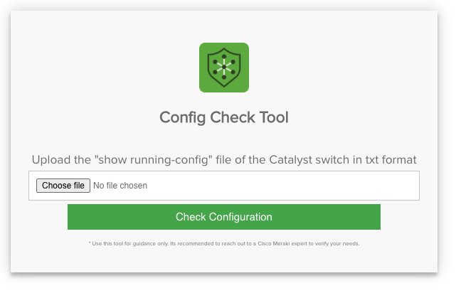
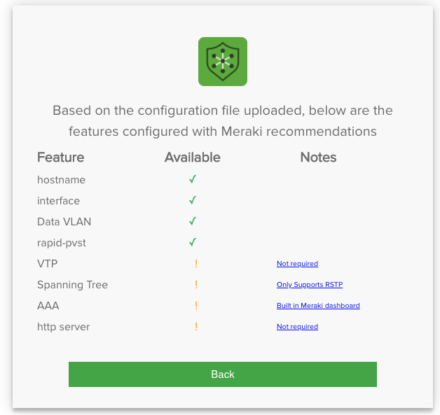

# Cisco Catalyst to Meraki MS Configuration Checker tool
This tool built to check the Cisco Catalyst configuration text file and verify if they are supported by the Meraki MS platform.

Below is the list of configuration the tool can read at this stage
- Hostname
- VTP mode
- MLS
- SNMP
- Logging
- NTP
- Access Lists Basic and Extended
- Port Mirroring
- AAA
- Netflow
- DHCP
- Banner
- RADIUS
- HTTP server
- Stack configuration
- MAB VLAN MAC
- VMPS
- IP Source Guard
- ARP Inspection
- DHCP Snooping
- ARP Access List
- PSP
- IP SLA
- Multicast modes
- Static Routing
- IPv6
- Interface Configuration
	- Private VLAN
	- VLAN Pruning
	- Voice and Data VLAN
	- STP configuration
		- Type of STP
		- Root Guard
		- Portfast
	- Flex Links
	- Storm control
	- Port Security
	- UDLD
	- LLDP
	- EtherChannel modes

# Solution Components

<Put the photo of High Level Diagram>
  
The script will parse the Cisco Catalyst configuration txt file and read the above-listed configuration, then save it in a dictionary. 


  
The script will also call the updated list of features that Meraki currently not supporting via a get request against http://msfeatures.netdecorators.com:7900/. 

The user will get an outcome page with the features currently supported by Meraki MS and the features that might not be needed to configure, and the features currently not supported by Meraki switches.




### Installation

1. Install python3 pip package
    ```bash
    $ sudo apt install python3-pip
    ```
2. Install packages from the requirements file.
    ```bash
   $ sudo pip3 install -r requirements.txt
    ```
3. Run the application 
    ```bash
   $ python3 app.py
    ```
    
### Use

From any browser enter http://ip_address:5000 or http://localhost:5000

### Demo

You can check the app here -> https://check.netdecorators.com/read

[](https://developer.cisco.com/codeexchange/github/repo/fadysharobeem/Catalyst_2_Meraki_Config_Checker)


### Linux Install
1. Install Ubuntu
2. Install Docker
	- sudo apt-get remove docker docker-engine docker.io containerd runc
	- sudo apt update
	- sudo apt install ca-certificates curl gnupg lsb-release
	- curl -fsSL https://download.docker.com/linux/ubuntu/gpg | sudo gpg --dearmor -o /usr/share/keyrings/docker-archive-keyring.gpg
	- 
			echo \
			"deb [arch=$(dpkg --print-architecture) signed-by=/usr/share/keyrings/docker-archive-keyring.gpg] https://download.docker.com/linux/ubuntu \
			$(lsb_release -cs) stable" | sudo tee /etc/apt/sources.list.d/docker.list > /dev/null
	- sudo apt update
	- sudo apt install docker-ce docker-ce-cli containerd.io
	- sudo docker run hello-world

3. Install git
	- https://git-scm.com/download/linux
	- apt install git
4. Clone this git repo
	- git clone 
5. 